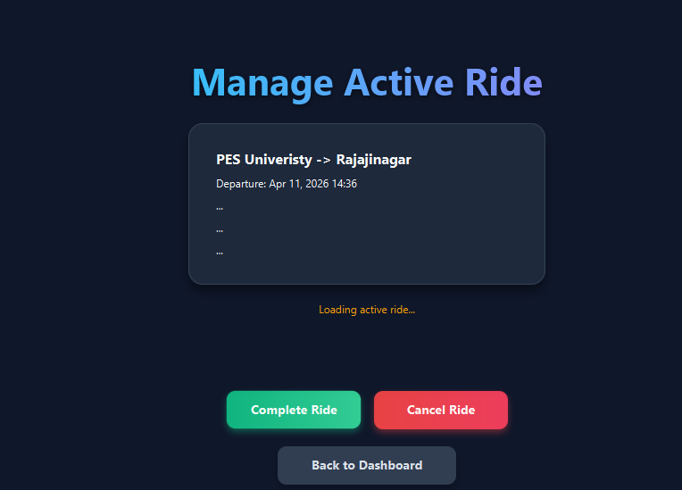

# RideSync - College Ride Sharing System

A comprehensive ride-sharing and carpooling system built with Java technologies for college campus transportation.

## Technology Stack

### Backend
- **Framework:** Spring Boot (MVC Architecture)
- **Language:** Java 17+
- **Database:** H2 (Development) / PostgreSQL (Production)
- **ORM:** Spring Data JPA
- **Build Tool:** Maven

### Frontend
- **Framework:** JavaFX 17+
- **UI Components:** JavaFX Controls, CSS Styling
- **Charts:** JavaFX Charts for analytics

### Additional Technologies
- **Routing Algorithm:** Dijkstra's Algorithm
- **Map Data:** OpenStreetMap (OSM) format
- **Design Patterns:** Singleton, Factory, Observer, Strategy, etc.

## Project Structure

```
RideSync/
├── src/
│   ├── main/
│   │   ├── java/com/ridesync/
│   │   │   ├── controller/     # Spring MVC Controllers
│   │   │   ├── service/        # Business Logic
│   │   │   ├── repository/     # Data Access Layer
│   │   │   ├── model/          # Entity Classes
│   │   │   ├── dto/            # Data Transfer Objects
│   │   │   ├── algorithm/      # Routing Algorithms
│   │   │   ├── pattern/        # Design Patterns
│   │   │   └── config/         # Configuration
│   │   └── resources/
│   │       ├── application.yml
│   │       └── static/
│   └── test/
├── frontend/
│   ├── src/main/java/com/ridesync/ui/
│   │   ├── controller/     # JavaFX Controllers
│   │   ├── view/           # FXML Views
│   │   ├── model/          # UI Models
│   │   └── util/           # UI Utilities
│   └── resources/
│       ├── fxml/           # FXML Files
│       ├── css/            # Stylesheets
│       └── images/         # UI Assets
└── docs/                   # UML Diagrams
```

## Major Features (4 Use Cases)

1. **User Registration & Profile Management**
   - Driver and Passenger registration
   - Profile verification
   - Vehicle registration for drivers

2. **Ride Creation & Matching**
   - Create ride offers (Driver)
   - Search and book rides (Passenger)
   - Automatic ride matching algorithm

3. **Real-time Ride Tracking**
   - Live ride status updates
   - Route visualization
   - Estimated arrival times

4. **Payment & Rating System**
   - Fare calculation
   - Payment processing simulation
   - Driver and passenger ratings

## Minor Features (4 Use Cases)

1. **Notification System**
2. **Ride History & Analytics**
3. **Emergency Contact System**
4. **Preferences & Settings**

## Quick Start

### Prerequisites
- Java 17+
- Maven 3.6+
- JavaFX SDK 17+

### 1. Start the Backend
```bash
mvn spring-boot:run
# → Starts on http://localhost:8080
```

### 2. Start the JavaFX Frontend
```bash
mvn javafx:run
```

### 3. Create your first Admin
Register via the API directly (or via the UI, then promote via DB):
```bash
curl -X POST http://localhost:8080/api/users/register \
  -H "Content-Type: application/json" \
  -d '{"name":"Admin","email":"admin@ridesync.com","password":"admin123","phone":"0000000000","role":"ADMIN"}'
```

## Running Tests
```bash
cd backend
mvn test
# Tests run on H2 in-memory DB — no MySQL needed
```

See `backend/README.md` and `frontend/README.md` for full API and feature docs.
