# RideSync UML Diagrams

## Use Case Diagram

```mermaid
graph TD
    A[RideSync System] --> B[User Registration & Profile Management]
    A --> C[Ride Creation & Matching]
    A --> D[Real-time Ride Tracking]
    A --> E[Payment & Rating System]
    A --> F[Notification System]
    A --> G[Ride History & Analytics]
    A --> H[Emergency Contact System]
    A --> I[Preferences & Settings]
    
    B --> J[Driver Registration]
    B --> K[Passenger Registration]
    B --> L[Profile Verification]
    B --> M[Profile Updates]
    
    C --> N[Create Ride Offer]
    C --> O[Search Rides]
    C --> P[Book Ride]
    C --> Q[Automatic Matching]
    
    D --> R[Start Ride]
    D --> S[Track Location]
    D --> T[ETA Updates]
    D --> U[Complete Ride]
    
    E --> V[Fare Calculation]
    E --> W[Payment Processing]
    E --> X[Driver Rating]
    E --> Y[Passenger Rating]
    
    F --> Z[Send Notifications]
    F --> AA[View Notifications]
    F --> BB[Mark as Read]
    
    G --> CC[View History]
    G --> DD[View Statistics]
    G --> EE[Generate Reports]
    
    H --> FF[Add Emergency Contact]
    H --> GG[Trigger Emergency Alert]
    H --> HH[Share Trip Details]
    
    I --> II[Update Preferences]
    I --> JJ[Notification Settings]
    I --> KK[Privacy Settings]
```

## Class Diagram

```mermaid
classDiagram
    class User {
        -Long id
        -String name
        -String email
        -String phone
        -String password
        -UserRole role
        -boolean verified
        -double rating
        -String licenseNumber
        -String vehicleModel
        +register()
        +updateProfile()
        +getRating()
    }
    
    class Ride {
        -Long id
        -String source
        -String destination
        -int totalSeats
        -double farePerSeat
        -LocalDateTime departureTime
        -RideStatus status
        -User driver
        -List~Booking~ bookings
        +createRide()
        +startRide()
        +completeRide()
        +getAvailableSeats()
    }
    
    class Booking {
        -Long id
        -Ride ride
        -User passenger
        -int seatsBooked
        -BookingStatus status
        -Payment payment
        +bookRide()
        +cancelBooking()
        +processPayment()
    }
    
    class Payment {
        -Long id
        -Booking booking
        -double amount
        -PaymentStatus status
        -String paymentMethod
        +processPayment()
        +refundPayment()
    }
    
    class Rating {
        -Long id
        -Booking booking
        -User ratedUser
        -User ratingUser
        -int rating
        -String comment
        +rateUser()
        +getAverageRating()
    }
    
    class Notification {
        -Long id
        -User user
        -String message
        -NotificationType type
        -boolean isRead
        -LocalDateTime createdAt
        +sendNotification()
        +markAsRead()
    }
    
    class EmergencyContact {
        -Long id
        -User user
        -String name
        -String phone
        -String relationship
        +addContact()
        +triggerAlert()
    }
    
    class UserPreferences {
        -Long id
        -User user
        -String preferredLanguage
        -boolean notificationEmail
        -boolean allowLocationSharing
        +updatePreferences()
        +getSettings()
    }
    
    class DijkstraRoutingAlgorithm {
        -Map~String, Map~String, Double~~ graph
        +findShortestPath(String, String)
        +calculateDistance(String, String)
        +calculateEstimatedTime(String, String)
    }
    
    class RouteResult {
        -List~String~ path
        -double totalDistance
        -long estimatedTimeMinutes
        -double estimatedFare
        +getPath()
        +getTotalDistance()
    }
    
    User ||--o{ Ride : creates
    User ||--o{ Booking : makes
    Ride ||--o{ Booking : contains
    Booking ||--|| Payment : has
    Booking ||--|| Rating : receives
    User ||--o{ Rating : gives
    User ||--o{ Notification : receives
    User ||--o{ EmergencyContact : has
    User ||--|| UserPreferences : has
    DijkstraRoutingAlgorithm ..> RouteResult : creates
```

## Activity Diagram - Ride Booking Process

```mermaid
activityDiagram
    start
    :User searches for rides;
    :System finds available rides;
    :User selects ride;
    :User enters seat count;
    :System calculates fare;
    :User confirms booking;
    :System creates booking;
    :System processes payment;
    :Payment successful?;
    if (Payment successful?) then (yes)
        :System sends confirmation;
        :System notifies driver;
        :Booking confirmed;
    else (no)
        :System shows error;
        :User can retry;
    endif
    stop
```

## Activity Diagram - Ride Tracking

```mermaid
activityDiagram
    start
    :Driver starts ride;
    :System begins tracking;
    :Update location every 30 seconds;
    :Calculate progress percentage;
    :Update ETA;
    :Passengers view live tracking;
    :Ride completed?;
    if (Ride completed?) then (yes)
        :System stops tracking;
        :System marks ride complete;
        :System notifies passengers;
        :System processes payments;
        :System requests ratings;
    else (no)
        :Continue tracking;
    endif
    stop
```

## State Diagram - Ride Status

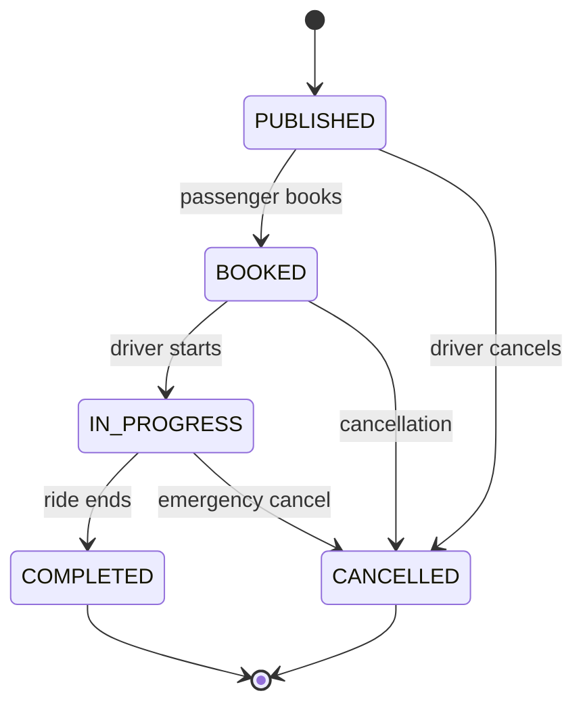

## State Diagram - Booking Status

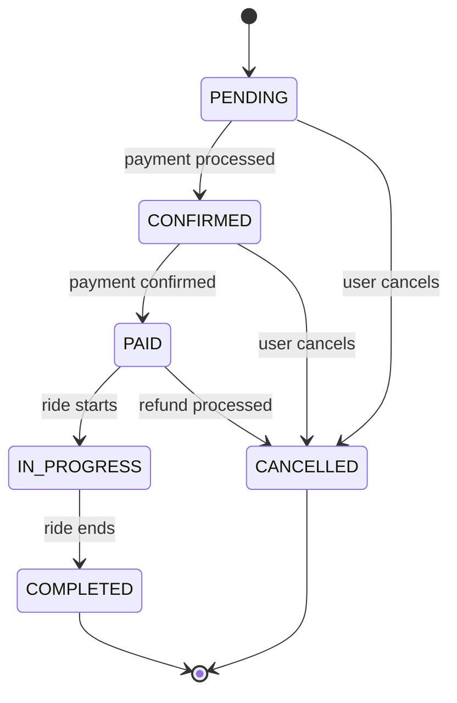

## Design Patterns Implementation

### 1. Singleton Pattern - DatabaseConnectionManager
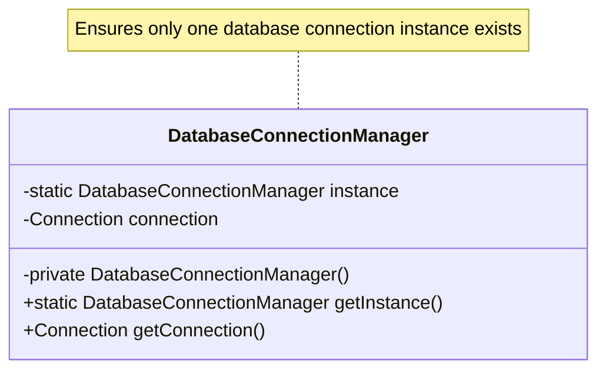

### 2. Factory Pattern - UserFactory
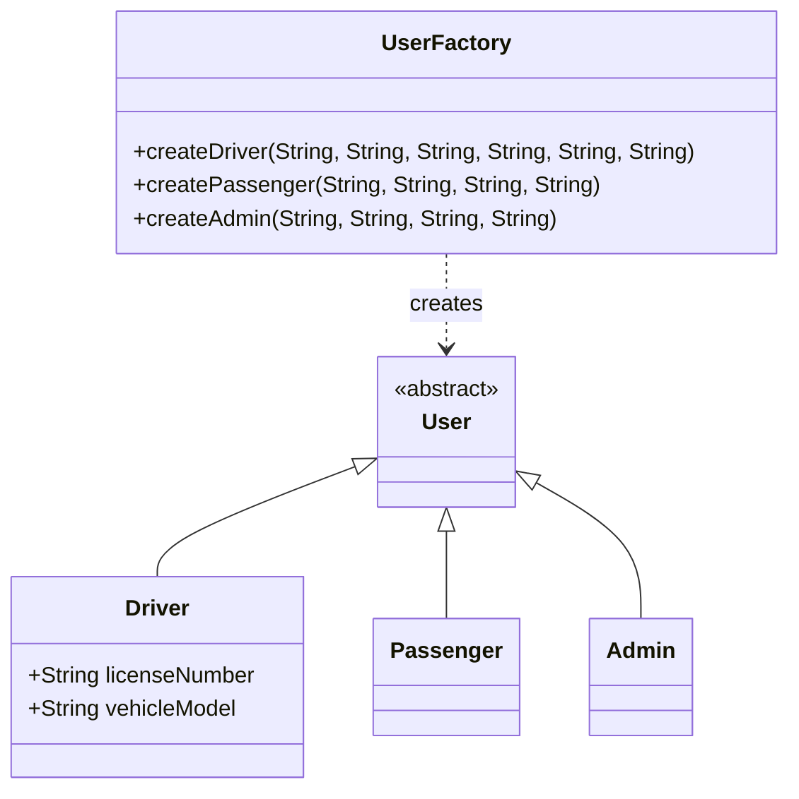

### 3. Builder Pattern - RideBuilder
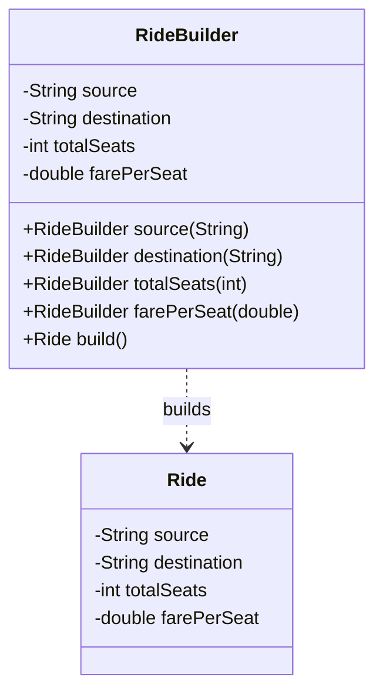

### 4. Strategy Pattern - RoutingAlgorithm
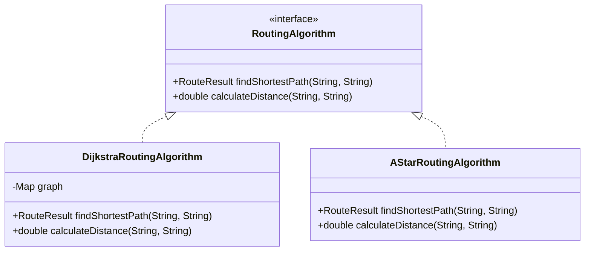

### 5. Observer Pattern - RideStatusManager
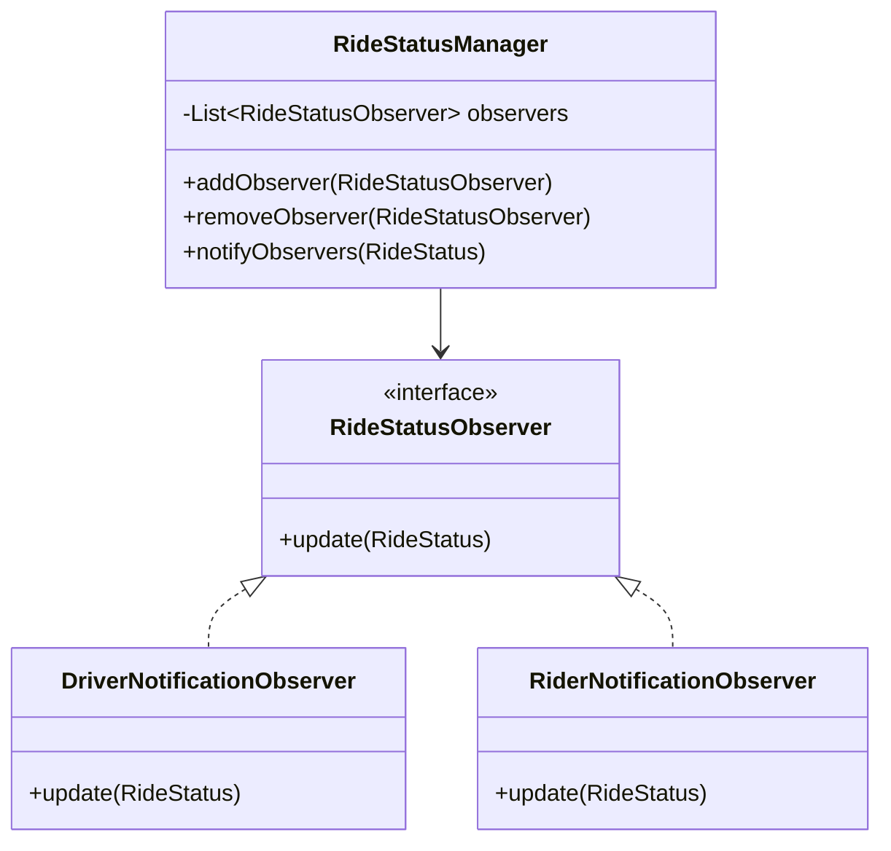

### 6. Command Pattern - RideBookingCommand
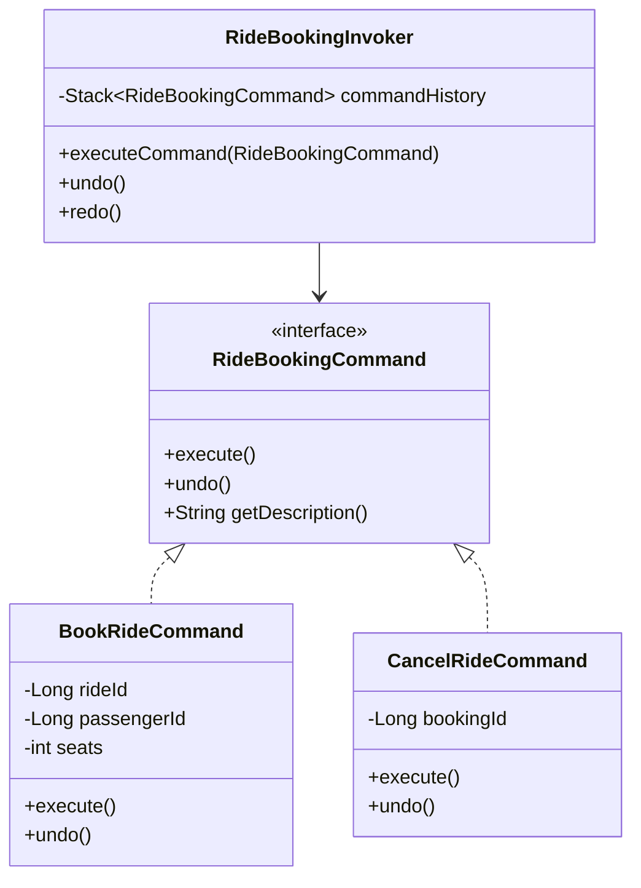

### 7. Adapter Pattern - MapDataAdapter
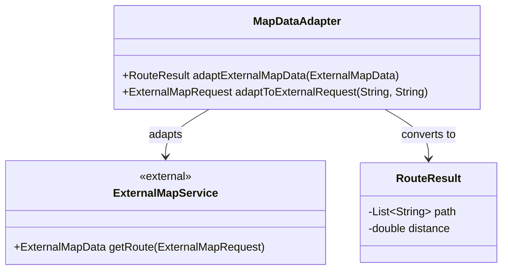

### 8. Facade Pattern - RideServiceFacade
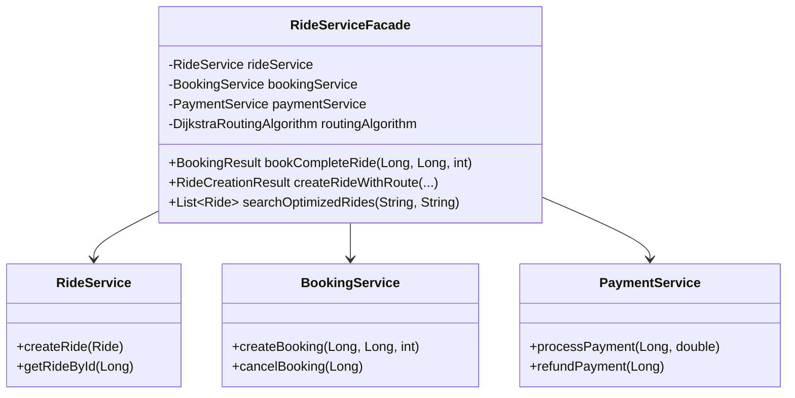

## Component Diagram

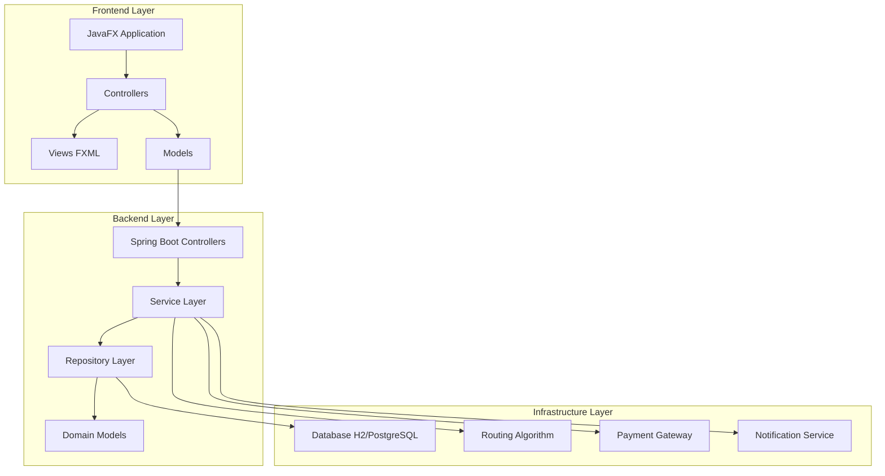

## Deployment Diagram

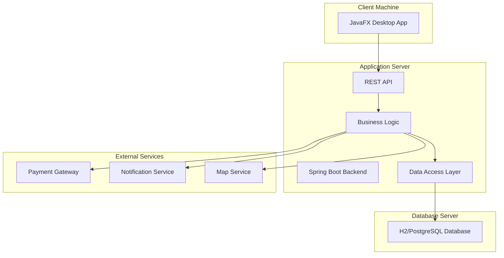

## Sequence Diagram - User Registration

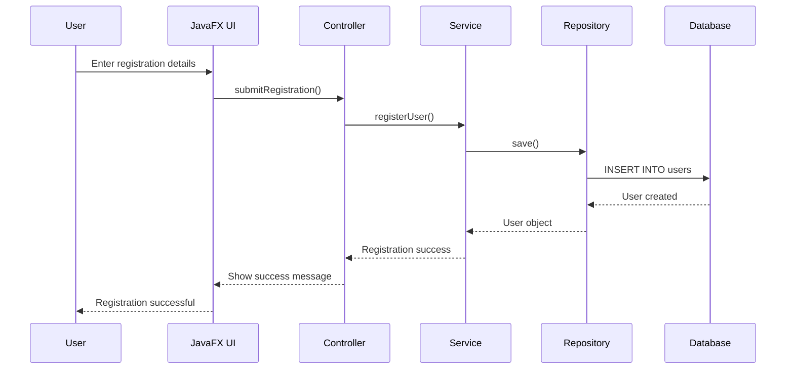

## Sequence Diagram - Ride Booking

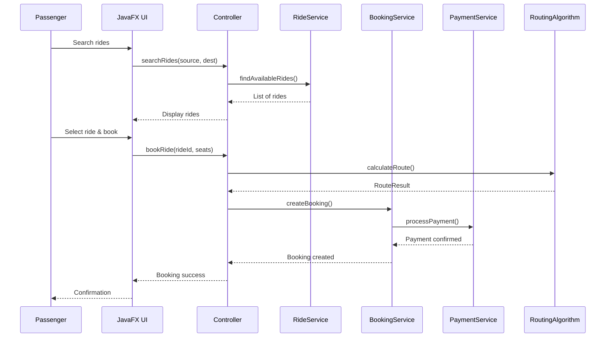
